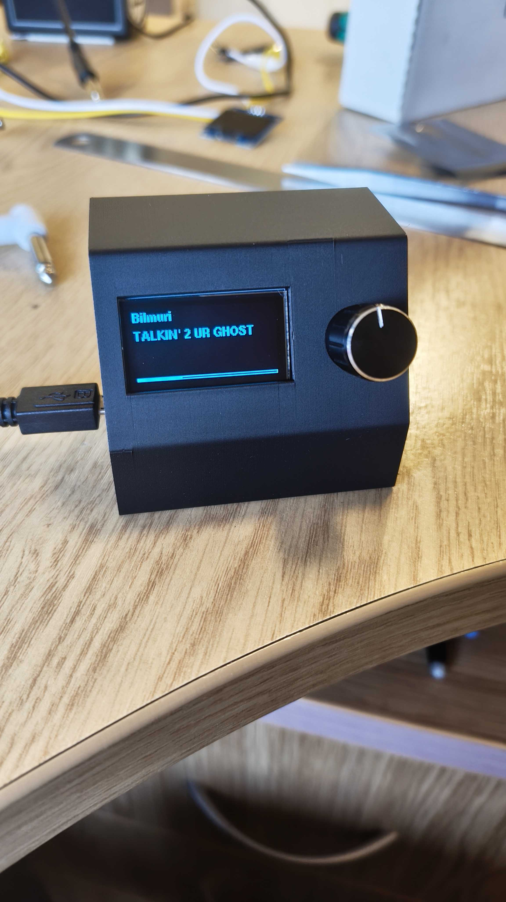

# SpotifyThing

A Raspberry Pi Pico W project that shows the currently playing Spotify track on an SH1106 OLED display. Supports play/pause, skip, and volume control via a rotary encoder.



<video src="images/video-1.mp4" controls></video>

## Hardware

| Part | Details |
|---|---|
| Microcontroller | Raspberry Pi Pico W |
| Display | SH1106 128×64 OLED (I2C, address 0x3C) |
| Input | KY-040 rotary encoder |

**Wiring:**

| Signal | GPIO |
|---|---|
| Display SDA | GP16 |
| Display SCL | GP17 |
| Encoder CLK | GP20 |
| Encoder DT | GP19 |
| Encoder SW | GP18 |

## Controls

| Action | Result |
|---|---|
| Rotate encoder | Adjust volume in 10% steps |
| Single press | Toggle play / pause |
| Double press | Skip to next track |

## Setup

### 1. Install PlatformIO

Install the [PlatformIO IDE extension](https://platformio.org/install/ide?install=vscode) for VS Code, or the PlatformIO Core CLI.

### 2. Clone the repo

```
git clone <repo-url>
cd SpotifyThing
```

### 3. Create a Spotify app

1. Go to the [Spotify Developer Dashboard](https://developer.spotify.com/dashboard) and create an app.
2. Add `http://127.0.0.1:3000/callback` as a redirect URI.
3. Note your **Client ID** and **Client Secret**.

### 4. Get an access token and refresh token

A script is included to handle the OAuth flow automatically. It opens a browser for you to authorise, captures the callback, and saves the tokens to `spotify_tokens.txt`.

**Install dependencies:**

```bash
pip install requests python-dotenv
```

**Create a `.env` file** in the project root:

```
SPOTIFY_CLIENT_ID=your-client-id
SPOTIFY_CLIENT_SECRET=your-client-secret
```

**Run the script:**

```bash
python get_spotify_token.py
```

It will open your browser, wait for you to log in and authorise, then print and save your tokens. Copy the `ACCESS_TOKEN` and `REFRESH_TOKEN` values for the next step.

### 5. Configure secrets

Copy the example secrets file and fill in your credentials:

```bash
cp src/secrets.h.example src/secrets.h
```

Edit `src/secrets.h`:

```c
#define WIFI_SSID             "your-wifi-ssid"
#define WIFI_PASS             "your-wifi-password"
#define SPOTIFY_CLIENT_ID     "your-client-id"
#define SPOTIFY_CLIENT_SECRET "your-client-secret"
#define SPOTIFY_ACCESS_TOKEN  "your-access-token"
#define SPOTIFY_REFRESH_TOKEN "your-refresh-token"
```

`secrets.h` is gitignored and will never be committed.

### 6. Set the upload port

In `platformio.ini`, update `upload_port` to the drive letter your Pico W mounts as when in BOOTSEL mode (e.g. `E:\` on Windows).

### 7. Flash

Put the Pico W into BOOTSEL mode by holding the BOOTSEL button while plugging in USB, then run the PlatformIO upload task:

```
pio run --target upload
```

Or use the **Upload** button in the PlatformIO VS Code sidebar.

## Project structure

```
src/
├── main.cpp           # setup() and loop() entry points
├── display.h/cpp      # SH1106 rendering, scroll logic, volume overlay
├── wifi_manager.h/cpp # WiFi connection
├── spotify.h/cpp      # Spotify API client (fetch, token refresh, controls)
├── userControls.h/cpp # Encoder input and gesture detection
└── secrets.h          # Your credentials (gitignored)
lib/
└── ky-040/            # KY-040 encoder driver
```

## Country code

The firmware defaults to `CYW43_COUNTRY_UK`. If you're in a different region, update the `build_flags` in `platformio.ini`:

```ini
build_flags = -DCYW43_COUNTRY=CYW43_COUNTRY_USA
```

A full list of country codes is in the [Pico W SDK docs](https://www.raspberrypi.com/documentation/microcontrollers/raspberry-pi-pico.html).
